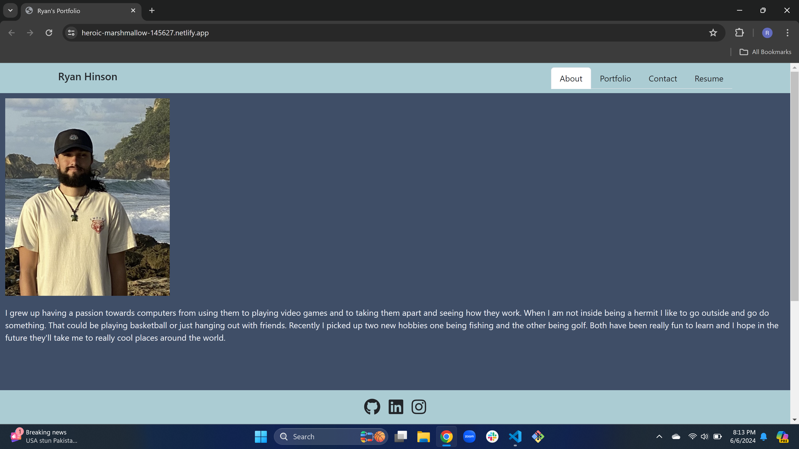
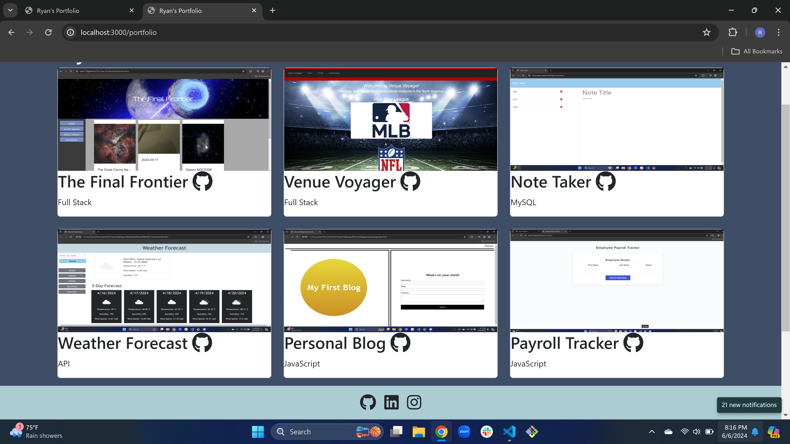
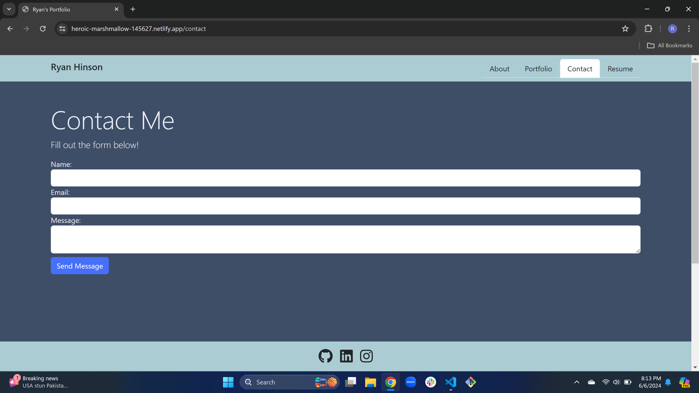
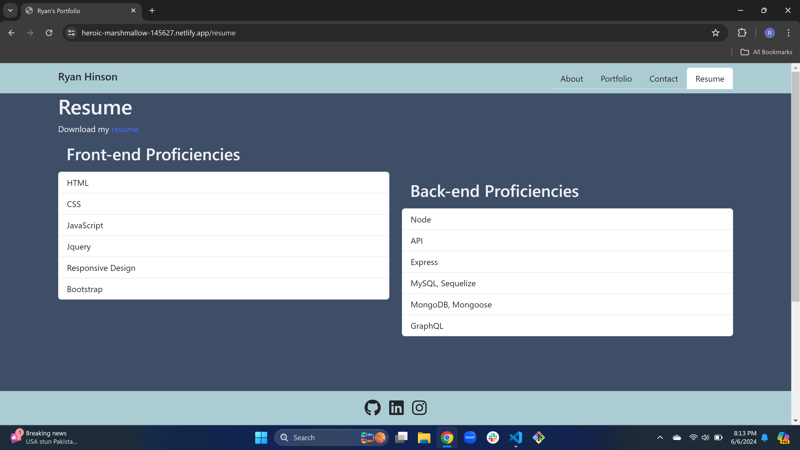

# React_Portfolio
Making a new portfolio site using React.

## Description

I was motivated in this challenge to make a new porfolio for myself using a new language I just learned React. The goal I wanted to complete was to use ReactRouter to have multiple pages for the site and to use new packages I've never used to make the site look good and respond quick. I also wanted to make my components work off of each other. I learned a lot of react during this challenge and how to use a new website provider in netlify which proved more challenging then expected. But it was a good learning experince none the less. 

## Website Link

https://heroic-marshmallow-145627.netlify.app

## Usage

